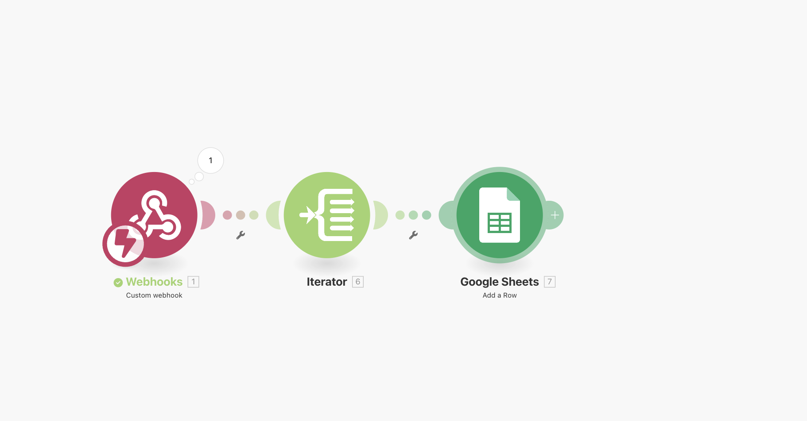
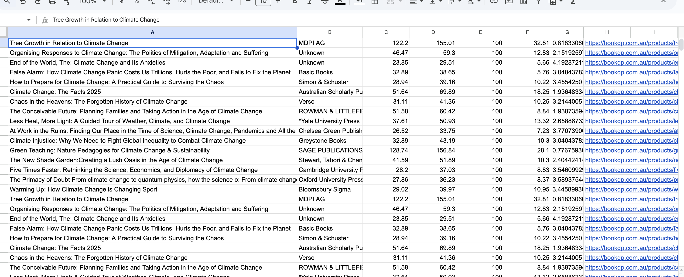
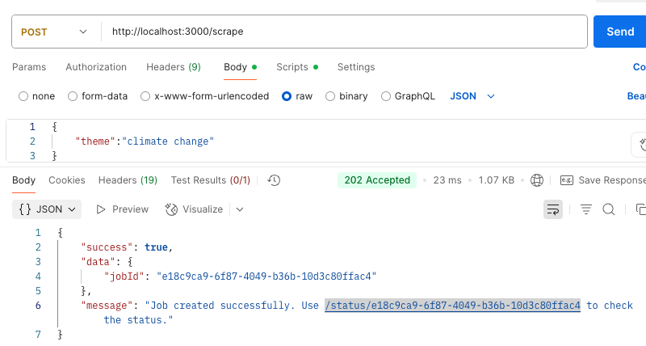
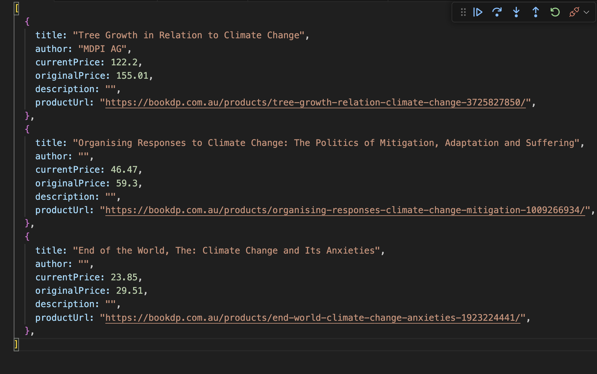

# Smart Book Discovery Agent

A TypeScript-based automation agent that intelligently scrapes book data from BookDP.com.au, enriches it with AI-powered analysis, and integrates with Make.com for automated workflows. The system provides comprehensive book discovery with relevance scoring, pricing analysis, and automated content summarization.

## 🚀 Project Overview

This application automates the process of discovering and analyzing books based on specific themes. It combines web scraping, AI-powered content analysis, and workflow automation to deliver enriched book data for decision-making and content curation.

### Key Features

- **Intelligent Web Scraping**: Extracts book data from BookDP.com.au using Playwright
- **AI-Powered Enrichment**: Generates summaries and relevance scores using OpenAI or local Ollama
- **Flexible AI Provider**: Seamlessly switch between OpenAI (production) and Ollama (development)
- **Make.com Integration**: Automated workflow triggers for downstream processing
- **Comprehensive Analysis**: Discount calculations, value scoring, and relevance assessment
- **Job Management**: Asynchronous processing with status tracking
- **Production Ready**: Docker containerization with health checks and monitoring

## 🏗️ Architecture and Approach

### System Architecture

```
┌─────────────────┐    ┌─────────────────┐    ┌─────────────────┐
│   Job Service   │───▶│ Scraper Service │───▶│Enrichment Svc   │
│                 │    │                 │    │                 │
│ • Job Creation  │    │ • Web Scraping  │    │ • AI Analysis   │
│ • Status Track  │    │ • Data Extract  │    │ • Summarization │
│ • Async Process │    │ • Error Handle  │    │ • Relevance     │
└─────────────────┘    └─────────────────┘    └─────────────────┘
         │                                              │
         │              ┌─────────────────┐             │
         └─────────────▶│Integration Svc  │◀────────────┘
                        │                 │
                        │ • Make.com API  │
                        │ • Webhook Send  │
                        │ • Error Handle  │
                        └─────────────────┘
```

### MAKE.COM INTEGRATION


### MAKE.COM INTEGRATION Google sheet



### Sample Request


### Scraped output sample


### Core Components

#### 1. **Job Service**
- **Purpose**: Orchestrates the entire book discovery pipeline
- **Responsibilities**: Job creation, status management, error handling
- **Pattern**: Async processing with comprehensive error recovery

#### 2. **Scraper Service** 
- **Technology**: Playwright for robust web scraping
- **Features**: Dynamic content handling, anti-detection measures
- **Data Extraction**: Title, price, description, availability, ratings

#### 3. **Enrichment Service**
- **AI Integration**: Dual provider support (OpenAI/Ollama)
- **Analysis**: Content summarization, theme relevance scoring
- **Calculations**: Discount analysis, value scoring algorithms

#### 4. **Integration Service**
- **Purpose**: Make.com webhook integration
- **Data Flow**: Structured payload delivery for workflow automation
- **Reliability**: Retry mechanisms and error handling

### AI Provider Abstraction

The system implements a flexible AI provider pattern:

```typescript
interface AIProvider {
    generateCompletion(request: CompletionRequest): Promise<CompletionResponse>;
}
```

### Data Flow

1. **Job Initialization**: User submits theme-based search request
2. **Web Scraping Phase**: Extract raw book data from BookDP.com.au
3. **AI Enrichment Phase**: Generate summaries and relevance scores
4. **Integration Phase**: Send enriched data to Make.com workflows
5. **Status Reporting**: Real-time job progress and completion status

## 🛠️ Local Development Setup

### Prerequisites

- **Node.js**: Version 18 or higher
- **npm**: Package manager
- **Ollama**: For local AI development (optional)
- **OpenAI API Key**: For production AI features

### Installation Steps

#### 1. Clone and Install Dependencies

```bash
git clone <repository-url>
cd smart-book-discovery-agent
npm install
```

### Commands

```bash
npm run start ## for production
npm run start:dev ##for development which will use olama by default
```

### Docker

```bash
npm run docker ## I have included a script to start docker-compose
```
#### 2. Environment Configuration

Create environment files based on your development needs:

**For Local Development (.env.development):**
```env
NODE_ENV=development
AI_PROVIDER=ollama
AI_BASE_URL=http://localhost:11434
AI_MODEL=llama2

# Make.com webhook URL
MAKECOM_WEBHOOK_URL=https://hook.make.com/your-webhook-id

# Server configuration
PORT=3000
```

**For Production (.env.production):**
```env
NODE_ENV=production
AI_PROVIDER=openai
OPENAI_API_KEY=your-openai-api-key-here
AI_MODEL=gpt-3.5-turbo-instruct

# Make.com webhook URL
MAKECOM_WEBHOOK_URL=https://hook.make.com/your-webhook-id

# Server configuration
PORT=3000
```

#### 3. Ollama Setup (for Local Development)

Install and configure Ollama for cost-free local development:

```bash
# Install Ollama
curl -fsSL https://ollama.ai/install.sh | sh

# Pull recommended models
ollama pull llama2
ollama pull llama2:7b-chat  # Faster alternative

# Start Ollama service
ollama serve

# Verify installation
curl http://localhost:11434/api/tags
```

#### 4. Development Commands

```bash
# Local development with Ollama (recommended)
npm run dev

# Local development with OpenAI (uses API credits)
npm run dev:openai

# Check if Ollama is running
npm run check-ollama

# Build for production
npm run build

# Start production server
npm start
```

### Docker Development

For containerized development with automatic service orchestration:

```bash
# Start development environment with Ollama
docker-compose --profile development up --build

# Start production environment
docker-compose up --build

# Start only Ollama service
docker-compose up ollama -d
```

### API Usage

#### Start a Book Discovery Job

```bash
curl -X POST http://localhost:3000/api/jobs \
  -H "Content-Type: application/json" \
  -d '{"theme": "artificial intelligence"}'
```

#### Check Job Status

```bash
curl http://localhost:3000/api/jobs/{job-id}
```

## 🔗 Make.com Integration Setup

### Integration Architecture

The system integrates with Make.com (formerly Integromat) to enable automated workflows based on enriched book data.

### Webhook Configuration

#### 1. Create Make.com Scenario

1. **Log into Make.com**: Access your Make.com dashboard
2. **Create New Scenario**: Start with a webhook trigger
3. **Configure Webhook**: 
   - Choose "Custom webhook"
   - Copy the generated webhook URL
   - Set data structure to JSON

#### 2. Expected Payload Structure

The integration service sends enriched book data in the following format:

```json
{
  "theme": "artificial intelligence",
  "timestamp": "2024-01-15T10:30:00Z",
  "totalBooks": 25,
  "books": [
    {
      "title": "Artificial Intelligence: A Modern Approach",
      "author": "Stuart Russell",
      "currentPrice": 89.95,
      "originalPrice": 109.95,
      "discountAmount": 20.00,
      "discountPercentage": 18.26,
      "summary": "Comprehensive textbook covering AI fundamentals and modern approaches to machine learning.",
      "relevanceScore": 95,
      "valueScore": 1.056,
      "availability": "In Stock",
      "rating": 4.5,
      "url": "https://bookdp.com.au/book/12345"
    }
  ]
}
```

#### 3. Environment Variable Setup

Add your Make.com webhook URL to your environment file:

```env
MAKECOM_WEBHOOK_URL=https://hook.make.com/your-webhook-id-here
```


## 📝 Assumptions and Limitations

### Technical Assumptions

#### Web Scraping
- **Target Site Stability**: BookDP.com.au structure remains relatively consistent
- **Rate Limiting**: Site allows reasonable scraping frequency without blocking
- **JavaScript Rendering**: Content is accessible after full page load
- **Data Availability**: Book information includes required fields (title, price, description)

#### AI Processing
- **Content Quality**: Book descriptions are meaningful and contain relevant information
- **Language**: All content is in English for optimal AI processing
- **Model Availability**: 
  - OpenAI models remain accessible and maintain current pricing
  - Ollama models (llama2) provide acceptable quality for development

#### Integration
- **Make.com Availability**: Webhook endpoints remain stable and accessible
- **Network Connectivity**: Reliable internet connection for external API calls
- **API Limits**: Services operate within rate limits and quotas


